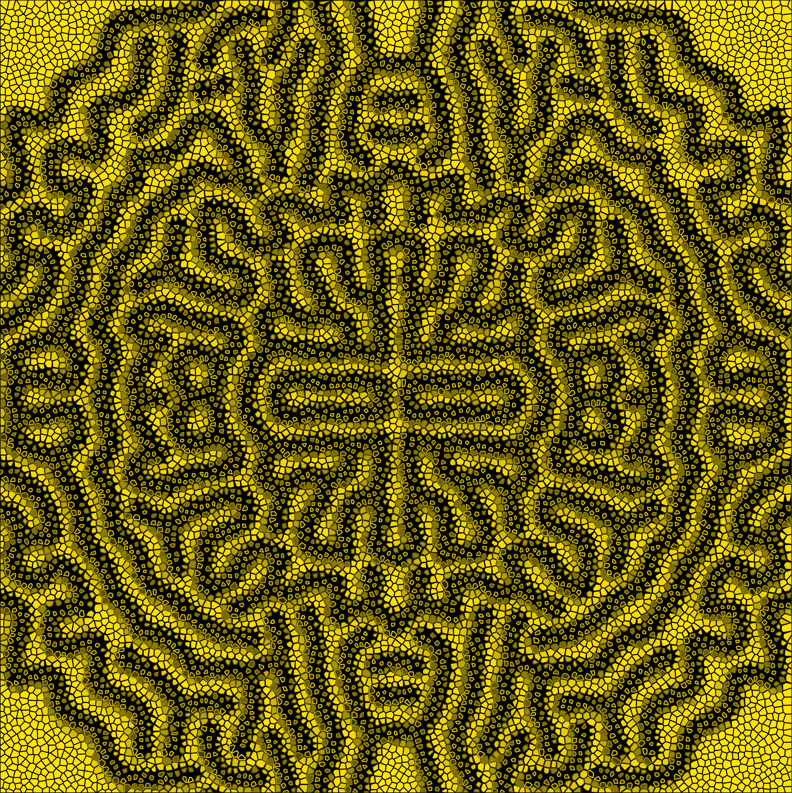

```{r setup, include=FALSE}
knitr::opts_chunk$set(echo = FALSE)
library(here)
library(knitr)
library(slickR)
library(htmlwidgets)
```

Here's some generative art made by a two-component reaction diffusion process. I first saw this style of art on [Antonio Sánchez Chinchón's blog](https://fronkonstin.com/2019/12/28/reaction-diffusion/) and gain further inspiration from articles by [Karl Sims](https://www.karlsims.com/rd.html) and [Robert Munafo](https://mrob.com/pub/comp/xmorphia/).

```{r, echo = FALSE, fig.align = 'center', out.width = '80%'} 

```

In short, the process generating these patterns is called the Gray-Scott reaction-diffusion model. The articles I linked above go into plenty of detail about the parameters guiding this process, so I won't rehash their work.

I made some colour palettes based on that of the (pretty incredible) conspiracy drama [Utopia](https://www.imdb.com/title/tt2384811/). The cinematography is pretty [vibrant](https://external-preview.redd.it/-jDVaUzmtdSYgYpbuyZI9UMx3m8WPGQIYFfRFtTE8qE.png?auto=webp&s=7e3a965e645d61b587486c00c2aa382db4c26a5b) so I wouldn't exactly call the figures it produces particularly easy on the eye, but I like the aesthetic nonetheless.

Anyway, here's a summary of how the final images come together...

Starting out, I used the [reaction diffusion C++ code](https://github.com/aschinchon/reaction-diffusion) provided by Antonio Sánchez Chinchón to make some initial figures. To manipulate their appearance, I went about writing a script that would automate the starting distributions of the two substances in the "reaction". This function allows me to dictate whether the starting pattern will be random, will be concentrated in a central circle/square/diamond, or will be spread across a series of concentric circles/squares/diamonds. 

Here are some examples of the types of images this can enable:

# ```{r, echo = FALSE, fig.align = 'center', out.width = '80%'} 
# images <- c("test1.png", "test2.png")
# slickR(obj = images, height = 100, width = "95%")
# ```

After that, I adapted the reaction diffusion equation to allow for variable feed and kill rates across the canvas. This enables even more varied diffusion patterns; patterns where the diffusion almost drips down the canvas, patterns where it pools primarily in the centre, and so on.

Again, it'd be easiest to demonstrate this with some examples:


The penultimate stylistic layer involved using the [poissoned package](https://coolbutuseless.github.io/2019/06/25/poissoned-a-package-for-poisson-disc-sampling/) to generate points upon which a Voronoi diagram was overlaid. The colour of each of the tiles in the Voronoi tesselation was determined by the colour that lay directly beneath the point that the tile was centred on. Finally, the outline of each tile was also defined by the same value, but was given the inverse of the colour palette, to provide depth.

Here are some examples of the output to this point:


Finally, the tiles were shrunken inwards proportional to their concentration of the diffusing substance, B (i.e., their colour). This makes the background beneath the tiling visible, so I set that to take on the colour of one of the extremes of the colour gradient being used for the fill of the polygons.

And we arrive at the completed image! I've added some more examples here:

```{r, echo = FALSE, fig.align = 'center', out.width = '80%'} 
images <- c("brainplot.png", "fullplot.png", "fullplot2.png", "fullplot3.png", "fullplot4.png", "fullplot5.png")
slickR(obj = images, height = 600, width = "95%")
```


